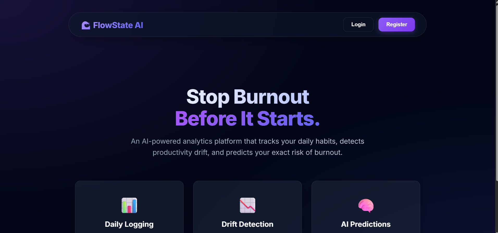
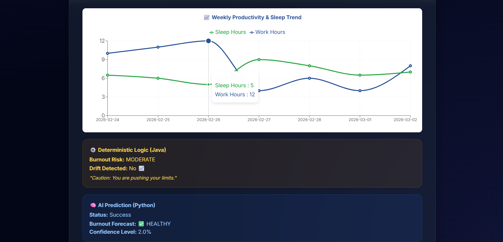

# 🌊 FlowState AI: Burnout Detection & Productivity Drift System

    

A full-stack, fully containerized Microservice platform designed to track daily productivity habits, visualize trends, and proactively detect the risk of developer burnout using a **Hybrid Intelligence** approach (Deterministic Java Rules + Probabilistic Machine Learning).

## 🚀 Key Features
* **Modern Midnight UI:** A sleek, glassmorphism-inspired dark mode interface built with React.
* **Daily Metric Logging:** Securely track work hours, sleep hours, stress levels, mood, and completed tasks.
* **Interactive Visual Analytics:** Real-time data visualization of productivity trends over a 7-day rolling window using Recharts.
* **Deterministic Rule Engine (Java):** Analyzes moving averages to detect immediate "Productivity Drift" (e.g., sleep dropping below healthy thresholds while stress spikes).
* **AI Burnout Prediction (Python/ML):** A dedicated Machine Learning microservice (Random Forest) that forecasts the exact probability of long-term burnout based on historical patterns.

## 🛠️ Architecture & Tech Stack

This project is built using an enterprise-grade Microservice architecture, fully containerized for one-click deployment.

### 1. Frontend (User Interface)
* **React.js**: Single Page Application with dynamic state management.
* **CSS3/Glassmorphism**: Custom CSS variables, gradients, and soft-shadow UI.
* **Axios**: HTTP client equipped with JWT interceptors for secure API communication.

### 2. Backend (Core Business Logic)
* **Java 21 & Spring Boot 3**: RESTful API acting as the central orchestrator.
* **Spring Security & JWT**: Stateless, token-based authentication.
* **Hibernate/Spring Data JPA**: ORM for robust database interactions.
* **MySQL 8**: Relational database for persistent storage.

### 3. ML Service (Analytics Engine)
* **Python 3.10 & Flask**: Lightweight microservice dedicated solely to serving ML predictions.
* **Scikit-Learn**: Machine learning model trained to predict burnout risks.

## 🐳 How to Run Locally (Docker)

You do not need to install Java, Python, Node, or MySQL on your local machine. The entire infrastructure is containerized.

**Prerequisites:**
* [Docker Desktop](https://www.docker.com/products/docker-desktop/) installed and running.

**Steps:**
1. Clone the repository:
   ```bash
   git clone [https://github.com/your-username/your-repo-name.git](https://github.com/your-username/your-repo-name.git)

2. Open a terminal in the root directory and run:
     ```bash
     docker-compose up --build

3. Once the terminal indicates all containers are running, navigate to:
     Frontend Application:
     ```bash
      http://localhost:3000

Note: The application includes a DataSeeder that automatically creates a demo_user (password: password123) populated with 7 days of historical data so you can immediately test the analytics and charts.

---

**Screenshots**


**Architecture**


---
**HomePage**



---
**Productivity-Logger-Page**




Author-
Mohammad Anas

Thank you for Reading